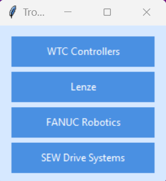

# Troubleshooting-Wizard

A Python-based GUI application for industrial equipment troubleshooting and error code management. This tool provides a centralized interface for accessing error codes, manuals, and troubleshooting resources for various manufacturing technologies.

## 🚀 Features

- **Multi-Technology Support**: Configurable support for different industrial technologies.
- **Error Code Search**: Interactive search functionality for error codes with PDF integration.
- **PDF Processing**: Extract and store error code tables from PDF manuals into an SQLite database.
- **Intuitive GUI**: User-friendly tkinter interface with navigation and search capabilities.
- **Configuration-Driven**: JSON-based configuration for easy customization and maintenance.
- **Security**: Sensitive data (configuration, media files) is kept local and excluded from version control by default.

## 🖼️ Screenshots

### Main Application Flow

| Technology Selection | Task Selection |
| :---: | :---: |
| *Select from various industrial technologies* | *Choose between error code search or manual access* |
|  |  |

### Error Code Search Options

| PDF Error Codes | PDF Viewer | Database Error Codes |
| :---: | :---: | :---: |
| *Search error codes in PDF manuals* | *Interactive PDF viewing with search* | *Search SEW error codes from database* |
|  |  |  |

## 🧪 Testing

### Running Tests

To run the test suite, first install the development dependencies:

```bash
pip install -e ".[dev]"
```

Then run the tests with coverage:

```bash
pytest
```

For more detailed output and coverage report:

```bash
pytest -v --cov=src --cov-report=term-missing
```

### Test Organization

- **Unit Tests**: Located in `tests/` directory
  - `test_core.py`: Tests for core application functionality
  - `test_main.py`: Tests for the main application class and UI components
  - `conftest.py`: Common test fixtures and configurations

### Writing Tests

- Test files should be named `test_*.py`
- Test functions should start with `test_`
- Use fixtures defined in `tests/conftest.py` for common test setup
- Mock external dependencies using `unittest.mock`
- Follow the Arrange-Act-Assert pattern
- Keep tests focused and independent
- Test both success and error cases

### Test Coverage

The project maintains high test coverage, focusing on:
- Core application logic
- UI component interactions
- Error handling
- Edge cases

To generate an HTML coverage report:

```bash
pytest --cov=src --cov-report=html
```

Then open `htmlcov/index.html` in your browser to view the coverage report.

### Test Structure

```
tests/
├── __init__.py         # Makes tests a Python package
├── conftest.py         # Test fixtures and configuration
├── test_*.py           # Unit tests
└── integration/        # Integration tests
    └── test_*.py
```

### Test Coverage

Test coverage reports are generated in the `coverage.xml` file and can be viewed in your IDE or CI system.

## 🛠️ Technologies Supported

- WTC (Welding Technology Corporation) Controllers
- Lenze Drive Systems
- FANUC Robotics Systems
- Atlas Copco Systems
- Clinching Systems
- Control Systems
- Tightening Systems
- Laser Systems
- SEW Drive Systems
- And more (easily extensible via configuration)

## 📁 Project Structure

```
Troubleshooting-Wizard/
├── .github/                # GitHub workflows and AI instructions
│   ├── workflows/          # CI/CD automation
│   ├── AGENT.md            # Gemini Code Assist instructions
│   └── copilot-instructions.md # GitHub Copilot instructions
├── docs/                   # Documentation
│   ├── CHANGELOG.md        # Version history
│   ├── CONTRIBUTING.md     # Contribution guidelines
│   └── GIT_WORKFLOW.md     # Git workflow guidelines
├── scripts/                # Development automation tools
│   ├── format_code.py      # Code quality checks
│   ├── test_workflow.py    # Workflow validation
│   └── release_manager.py  # Automated releases
├── src/                    # Source code
│   ├── main.py             # Main application class
│   ├── database_manager.py # Database operations
│   ├── ui_components.py    # UI styling and components
│   └── pdf_viewer.py       # PDF viewing functionality
├── tests/                  # Test suite
│   ├── test_*.py           # Unit tests
│   └── integration/        # Integration tests
├── data/                   # Application data and configuration
├── media/                  # Images and resources
├── logs/                   # Application logs
└── run.py                  # Application entry point

## ⚙️ Setup and Installation

### Prerequisites

- Python 3.7 or higher (tested with Python 3.13)
- pip (Python package installer)
- Git

### Installation Steps

1.  **Clone the repository:**
    ```bash
    git clone <repository-url>
    cd <repository-folder>
    ```

2.  **Create and activate a virtual environment:**
    ```powershell
    # For Windows (PowerShell)
    py -3 -m venv .venv
    .\.venv\Scripts\Activate.ps1
    ```
    ```bash
    # For macOS/Linux
    python3 -m venv .venv
    source .venv/bin/activate
    ```

3.  **Install dependencies:**
    ```bash
    pip install -r requirements.txt
    ```

4.  **Configure your application**:
    - Create `src/data.json` by copying the example file:
      ```bash
      cp src/example_data.json src/data.json
      ```
    - Update `src/data.json` with your specific file paths and URLs. This file is ignored by Git.

5.  **Set up media files**:
    - Place your actual error code screenshots, manuals, and diagrams in the `media/` directory.
    - Replace example files with your actual error code screenshots.
    - Add new image files as needed for your specific equipment.
    - Update your `data.json` to reference the correct image file names.
    - Keep file names descriptive (e.g., `WTC_ErrorCodes_Screenshot.png`).
    - Supported formats: PNG (recommended for screenshots), JPG (good for photographs).
    - Recommended size: 800x600 pixels or larger for readability.

## ▶️ Running the Application

Once you have completed the setup and installation, you can run the application from the root directory of the project:

```bash
python run.py
```

## 📝 Logging

The application is configured with a robust logging system that captures informational messages, warnings, and errors.

- **Log Files**: Logs are automatically saved in the `logs/` directory.
- **Rotation**: A new log file is created daily, and logs are kept for up to 7 days.
- **Purpose**: These logs are invaluable for debugging issues and understanding the application's behavior over time.

## 🔧 Configuration

The application uses a dual-file configuration system for security and ease of use:

1.  **`src/example_data.json`** (Committed to repository)
    - A template with example URLs and a standardized structure. It's safe to commit.
2.  **`src/data.json`** (User-created, not committed)
    - Your local configuration containing actual URLs, file paths, and credentials. It is automatically ignored by Git.

### Configuration Structure
```json
{
  "MainApplication": {
    "title": "Your Application Title",
    "width": 350,
    "height": 470,
    "Technologies": {
      "TechnologyName": {
        "button_text": "Display Name",
        "url_variable_name": "https://your-actual-url.com/path/to/file.pdf",
        "tasks": ["..."]
      }
    }
  }
}
```

### Adding New Technologies
1.  Add a new technology section in your `data.json`.
2.  Define URL variables for your documents.
3.  Create tasks with appropriate types: `error_codes` or `open_url`.
4.  Add corresponding image files to the `media/` directory.

### Media Files Management
The `media/` directory contains image files used by the application:

**Example Files (Committed):**
- `example_wtc_errors.png` - Placeholder for WTC controller error codes
- `example_lenze_errors.png` - Placeholder for Lenze drive error codes
- `example_fanuc_alarms.png` - Placeholder for FANUC robot alarm codes

**Your Files (Not Committed):**
- Screenshots of actual error code displays
- System diagrams and flowcharts
- Training documentation images
- Any corporate-specific visual content

**Security Note:** Your actual image files containing corporate-specific information will not be committed to version control, keeping sensitive data secure while maintaining the application structure.

### Path Configuration
-   **Image paths**: Use relative paths like `../media/your_image.png`.
-   **Document URLs**: Use full URLs or local file paths.
-   **Variable substitution**: Use `{{variable_name}}` syntax for URL variables.

## 🎯 Usage

### Main Application
1.  Launch the application: `python run.py`
2.  Select a technology from the main menu.
3.  Choose from available tasks (e.g., search error codes, open manuals).

### PDF Processing Tool
Process PDF manuals to extract error code tables into the database:
```bash
python src/process_pdf.py --pdf-path "path/to/manual.pdf" --table-name "error_codes" --start-page 1 --end-page 10
```
**Parameters:**
- `--pdf-path`: Full path to the PDF file.
- `--table-name`: Database table name for storing data.
- `--start-page`: First page to process.
- `--end-page`: Last page to process.

### SEW Error Code Extraction
This application supports robust extraction of SEW Drive System error codes. Run the utility with the `--sew-mode` flag:
```bash
python src/process_pdf.py --pdf-path <path_to_sew_pdf> --start-page <first_page> --end-page <last_page> --sew-mode
```
This will store the results in the `sew_error_codes` table in `src/errorCodesTechnologies.db`.

## 🧑‍💻 Development

### Configuration Best Practices
1.  **Never commit `src/data.json`** or corporate media files.
2.  Update `src/example_data.json` when adding new features.
3.  Use relative paths for media files and placeholder URLs in `example_data.json`.

### Security Features
-   **Automatic data protection**: Real configuration and media files are automatically ignored by git.
-   **Sensitive data isolation**: All corporate-specific content stays local.

### Code Style
This project follows PEP 8 Python style guidelines and uses object-oriented programming patterns.

## 🧑💻 Development

### Automated Development Workflow

This project includes automated tools to ensure code quality and streamline development:

```bash
# During development (fast code quality checks)
python scripts/format_code.py

# Before pushing (comprehensive validation)
python scripts/test_workflow.py

# For releases (automated version management)
python scripts/release_manager.py patch --changes "Bug fixes and improvements"

# One-time setup for new developers
python scripts/setup_automation.py
```

### Code Quality Standards
- **Strict compliance** with Black, Flake8, and isort
- **100-character line length** standard
- **Zero warnings/errors** requirement
- **Pre-commit hooks** for automatic quality enforcement
- **21.24% test coverage** with comprehensive test suite

### Configuration Best Practices
1.  **Never commit `data/data.json`** or corporate media files.
2.  Update `data/example_data.json` when adding new features.
3.  Use relative paths for media files and placeholder URLs in `example_data.json`.

### Security Features
-   **Automatic data protection**: Real configuration and media files are automatically ignored by git.
-   **Sensitive data isolation**: All corporate-specific content stays local.

## 🤝 Contributing

We welcome contributions! Please see the `docs/CONTRIBUTING.md` file for detailed guidelines on the development workflow, commit messages, and the review process. Project-specific instructions for AI assistants are located in `.github/copilot-instructions.md`.

## 📝 License

This project is licensed under the MIT License. See the `LICENSE` file for details.

## 💬 Support

For issues or questions, please open an issue in the project repository.

---
**Version: 1.2.0**
**Last Updated: September 30, 2025**
