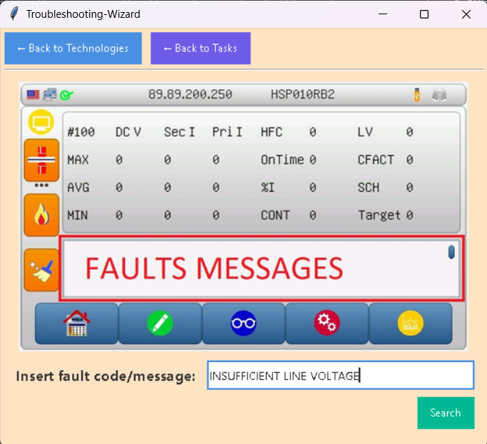

# Troubleshooting-Wizard

[](https://github.com/KirilMT/Troubleshooting-Wizard/actions/workflows/ci.yml)
[](https://github.com/KirilMT/Troubleshooting-Wizard/actions/workflows/code-quality.yml)
[](https://opensource.org/licenses/MIT)
[](https://www.python.org/downloads/)

A Python-based GUI application for industrial equipment troubleshooting and error code management. This tool provides a centralized interface for accessing error codes, manuals, and troubleshooting resources for various manufacturing technologies.

## 🚀 Features

- **Multi-Technology Support**: Configurable support for different industrial technologies
- **Error Code Search**: Interactive search functionality with PDF integration
- **PDF Processing**: Extract and store error code tables from PDF manuals into SQLite database
- **Intuitive GUI**: User-friendly tkinter interface with navigation and search capabilities
- **Configuration-Driven**: JSON-based configuration for easy customization and maintenance
- **Security**: Sensitive data is kept local and excluded from version control

## 🛠️ Technologies Supported

- WTC (Welding Technology Corporation) Controllers
- Lenze Drive Systems
- FANUC Robotics Systems
- SEW Drive Systems
- And more (easily extensible via configuration)

## 🖼️ Screenshots

### Main Application Flow

| Technology Selection | Task Selection |
| :---: | :---: |
| *Select from various industrial technologies* | *Choose between error code search or manual access* |
|  |  |

### Error Code Search Options

| PDF Error Codes | PDF Viewer | Database Error Codes |
| :---: | :---: | :---: |
| *Search error codes in PDF manuals* | *Interactive PDF viewing with search* | *Search SEW error codes from database* |
|  |  |  |

## ⚙️ Setup and Installation

### Prerequisites

- Python 3.7+ (tested with Python 3.13)
- pip (Python package installer)
- Git

### Installation Steps

1. **Clone the repository:**
   ```bash
   git clone <repository-url>
   cd <repository-folder>
   ```

2. **Create and activate a virtual environment:**
   ```powershell
   # Windows (PowerShell)
   py -3 -m venv .venv
   .\.venv\Scripts\Activate.ps1
   ```
   ```bash
   # macOS/Linux
   python3 -m venv .venv
   source .venv/bin/activate
   ```

3. **Install dependencies:**
   ```bash
   pip install -r requirements.txt
   ```

4. **Configure your application:**
   ```bash
   cp src/example_data.json src/data.json
   ```
   Update `src/data.json` with your specific file paths and URLs. This file is ignored by Git.

5. **Set up media files:**
   - Place error code screenshots, manuals, and diagrams in the `media/` directory
   - Replace example files with actual content
   - Update `data.json` to reference correct image file names
   - Use descriptive names (e.g., `WTC_ErrorCodes_Screenshot.png`)
   - Recommended formats: PNG (screenshots), JPG (photographs)
   - Recommended size: 800x600 pixels or larger

## ▶️ Usage

### Running the Application

```bash
python run.py
```

### Main Application Workflow

1. Launch the application
2. Select a technology from the main menu
3. Choose from available tasks (search error codes, open manuals)

### PDF Processing Tool

Extract error code tables from PDF manuals:

```bash
python src/process_pdf.py --pdf-path "path/to/manual.pdf" --table-name "error_codes" --start-page 1 --end-page 10
```

**Parameters:**
- `--pdf-path`: Full path to the PDF file
- `--table-name`: Database table name for storing data
- `--start-page`: First page to process
- `--end-page`: Last page to process

### SEW Error Code Extraction

For SEW Drive System error codes, use the specialized mode:

```bash
python src/process_pdf.py --pdf-path <path_to_sew_pdf> --start-page <first_page> --end-page <last_page> --sew-mode
```

Results are stored in the `sew_error_codes` table in `src/errorCodesTechnologies.db`.

## 🔧 Configuration

### Configuration System

The application uses a dual-file configuration system:

1. **`src/example_data.json`** (Template, committed to repository)
2. **`src/data.json`** (User configuration, automatically ignored by Git)

### Configuration Structure

```json
{
  "MainApplication": {
    "title": "Your Application Title",
    "width": 350,
    "height": 470,
    "Technologies": {
      "TechnologyName": {
        "button_text": "Display Name",
        "url_variable_name": "https://your-actual-url.com/path/to/file.pdf",
        "tasks": ["..."]
      }
    }
  }
}
```

### Adding New Technologies

1. Add a new technology section in your `data.json`
2. Define URL variables for your documents
3. Create tasks with appropriate types: `error_codes` or `open_url`
4. Add corresponding image files to the `media/` directory

### Media Files Management

**Example Files (Committed):**
- `example_wtc_errors.png` - Placeholder for WTC controller error codes
- `example_lenze_errors.png` - Placeholder for Lenze drive error codes
- `example_fanuc_alarms.png` - Placeholder for FANUC robot alarm codes

**Your Files (Not Committed):**
- Screenshots of actual error code displays
- System diagrams and flowcharts
- Training documentation images
- Corporate-specific visual content

**Security Note:** Actual image files containing corporate-specific information are not committed to version control.

### Path Configuration

- **Image paths**: Use relative paths like `../media/your_image.png`
- **Document URLs**: Use full URLs or local file paths
- **Variable substitution**: Use `{{variable_name}}` syntax for URL variables

## 📁 Project Structure

```
Troubleshooting-Wizard/
├── .github/                # GitHub workflows and AI instructions
│   ├── workflows/          # CI/CD automation
│   ├── AGENT.md            # Gemini Code Assist instructions
│   └── copilot-instructions.md # GitHub Copilot instructions
├── docs/                   # Documentation
│   ├── CHANGELOG.md        # Version history
│   ├── CONTRIBUTING.md     # Contribution guidelines
│   └── GIT_WORKFLOW.md     # Git workflow guidelines
├── scripts/                # Development automation tools
│   ├── format_code.py      # Code quality checks
│   ├── test_workflow.py    # Workflow validation
│   └── release_manager.py  # Automated releases
├── src/                    # Source code
│   ├── main.py             # Main application class
│   ├── database_manager.py # Database operations
│   ├── ui_components.py    # UI styling and components
│   └── pdf_viewer.py       # PDF viewing functionality
├── tests/                  # Test suite
│   ├── test_*.py           # Unit tests
│   └── integration/        # Integration tests
├── data/                   # Application data and configuration
├── media/                  # Images and resources
├── logs/                   # Application logs
└── run.py                  # Application entry point
```

## 🧑‍💻 Development

### Automated Development Workflow

Set up the complete development environment:

```bash
# One-time setup for new developers
python scripts/setup_environment.py
```

Development commands:

```bash
# During development (fast code quality checks)
python scripts/format_code.py

# Before pushing (comprehensive validation)
python scripts/test_workflow.py

# For releases (automated version management)
python scripts/release_manager.py patch --changes "Bug fixes and improvements"
```

### Code Quality Standards

- **PEP 8 compliance**: 100-character line length standard
- **Strict compliance** with Black, Flake8, and isort
- **Zero warnings/errors** requirement
- **Pre-commit hooks** for automatic quality enforcement
- **Object-oriented programming** patterns

## 🧪 Testing

### Running Tests

Install development dependencies:

```bash
pip install -e ".[dev]"
```

Run the test suite:

```bash
pytest
```

For detailed output with coverage:

```bash
pytest -v --cov=src --cov-report=term-missing
```

### Test Organization

- **Unit Tests**: Located in `tests/` directory
  - `test_core.py`: Core application functionality
  - `test_main.py`: Main application class and UI components
  - `conftest.py`: Common test fixtures and configurations

### Test Structure

```
tests/
├── __init__.py         # Makes tests a Python package
├── conftest.py         # Test fixtures and configuration
├── test_*.py           # Unit tests
└── integration/        # Integration tests
    └── test_*.py
```

### Writing Tests

- Test files: `test_*.py`
- Test functions: start with `test_`
- Use fixtures from `tests/conftest.py`
- Mock external dependencies using `unittest.mock`
- Follow Arrange-Act-Assert pattern
- Test both success and error cases

### Test Coverage

Generate HTML coverage report:

```bash
pytest --cov=src --cov-report=html
```

Open `htmlcov/index.html` to view the coverage report.

**Current Coverage**: 21.24% with comprehensive test suite focusing on core application logic, UI component interactions, and error handling.

## 📝 Logging

The application includes a robust logging system:

- **Log Files**: Automatically saved in the `logs/` directory
- **Rotation**: New log file created daily, kept for 7 days
- **Purpose**: Debugging and understanding application behavior

## 🤝 Contributing

We welcome contributions! Please see `docs/CONTRIBUTING.md` for detailed guidelines on:
- Development workflow
- Commit message standards
- Review process

Project-specific AI assistant instructions are in `.github/copilot-instructions.md`.

## 📝 License

This project is licensed under the MIT License. See the `LICENSE` file for details.

## 💬 Support

For issues or questions, please open an issue in the project repository.

---

**Version: 1.2.0** | **Last Updated: October 1, 2025**
